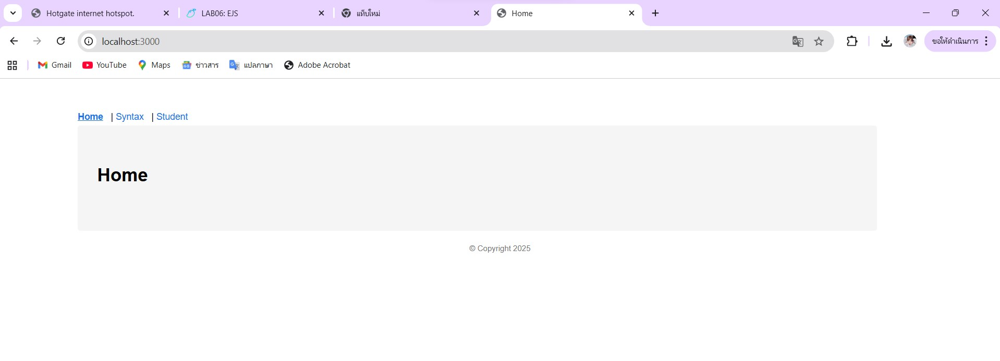
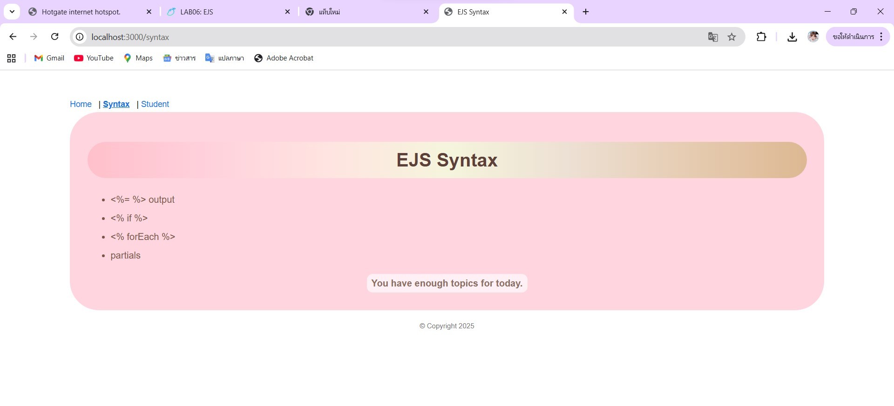
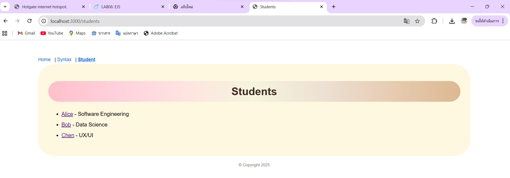
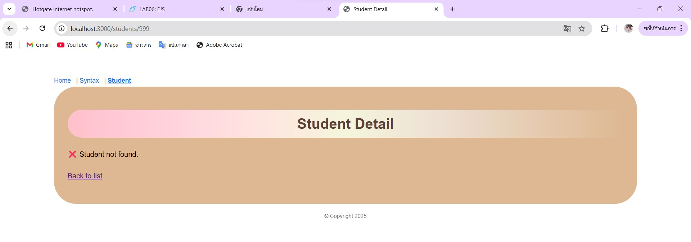

# Lab06 EJS Basic Piyada Ounta 68211031
## Screenshots

## Q&A
### 1. In one sentence: What does res.render(view, data) do?  
- It renders an EJS (or template) view file and sends the generated HTML to the browser using the provided data.

### 2. What is the difference between <%= %> and <%- %>?  
- <%= %> outputs the value into the template after escaping special HTML characters, which helps prevent security issues such as Cross-Site Scripting (XSS) attacks.  
- <%- %> outputs the value as raw HTML without escaping, allowing HTML tags to be rendered directly in the browser, but it should be used carefully because it can introduce security risks if the data comes from users.

### 3. Where does Express look for EJS templates (folder path)?  
- By default, Express searches for EJS template files inside the "views" directory located at the root of the project (e.g., project-root/views). This default path can be changed using app.set("views", "your-folder-name") if a custom folder is required.
